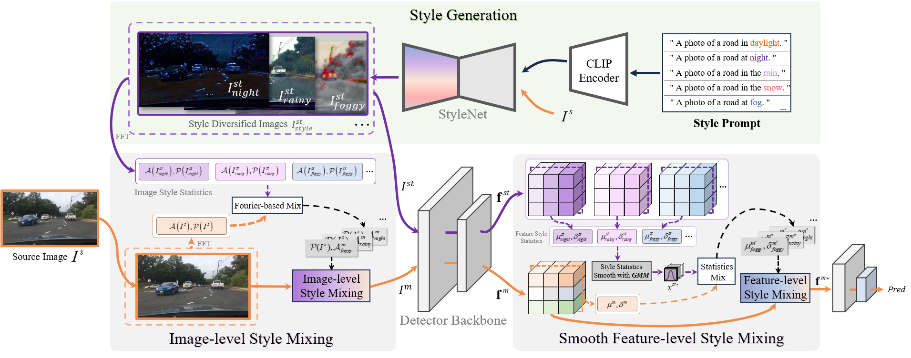

<p align="center">

  <h1 align="center">Language-Driven Dual Style Mixing for Single-Domain Generalized Object Detection</h1>
  <p align="center">
    <a href="https://scholar.google.com.hk/citations?user=W5hk8vAAAAAJ&hl=zh-CN&oi=sra"><strong>Hongda Qin*</strong></a>
    .
    <a href="https://scholar.google.com.hk/citations?hl=zh-CN&user=kT871PIAAAAJ"><strong>Xiao Lu*</strong></a>
    .
    <a href=""><strong>Zhiyong Wei</strong></a>
    .
    <a href="https://scholar.google.com.hk/citations?hl=zh-CN&user=j3364z8AAAAJ"><strong>Yihong Cao</strong></a>
    .
    <a href="https://yangkailun.com/"><strong>Kailun Yang</strong></a>
    .
    <a href=""><strong>Ningjiang Chen†</strong></a>
</p>

<div align="center">
  
[](https://arxiv.org/abs/2505.07219)
</div>


## Framework
<div align=center>

</div>

### Abstract

Generalizing an object detector trained on a single domain to multiple unseen domains is a challenging task. Existing methods typically introduce image or feature augmentation to diversify the source domain to raise the robustness of the detector. Vision-Language Model (VLM)-based augmentation techniques have been proven to be effective, but they require that the detector's backbone has the same structure as the image encoder of VLM, limiting the detector framework selection. To address this problem, we propose Language-Driven Dual Style Mixing (LDDS) for single-domain generalization, which diversifies the source domain by fully utilizing the semantic information of the VLM. Specifically, we first construct prompts to transfer style semantics embedded in the VLM to an image translation network. This facilitates the generation of style diversified images with explicit semantic information. Then, we propose image-level style mixing between the diversified images and source domain images. This effectively mines the semantic information for image augmentation without relying on specific augmentation selections. Finally, we propose feature-level style mixing in a double-pipeline manner, allowing feature augmentation to be model-agnostic and can work seamlessly with the mainstream detector frameworks, including the one-stage, two-stage, and transformer-based detectors. Extensive experiments demonstrate the effectiveness of our approach across various benchmark datasets, including real to cartoon and normal to adverse weather tasks.

## Updates
- [2025/05] Init repository. The code and datasets will be made publicly available upon acceptance of the paper. Thank you for your interest in our work!

## Citation
If you are interested in this work, please use the following BibTeX entry.

```
@article{qin2025languagedriven,
  title={Language-Driven Dual Style Mixing for Single-Domain Generalized Object Detection},
  author={Hongda Qin and Xiao Lu and Zhiyong Wei and Yihong Cao and Kailun Yang and Ningjiang Chen},
  journal={arXiv preprint arXiv:2505.07219},
  year={2025}
}
```

## References

We build on techniques from these open-source projects:

- [CLIPstyler](https://github.com/cyclomon/CLIPstyler): A real-time image stylization toolkit that uses CLIP-guided neural style transfer to apply diverse effects via text prompts.
- [MixStyle](https://github.com/KaiyangZhou/mixstyle-release): A domain generalization method that enhances model robustness by randomly mixing feature statistics from different instances during training.
